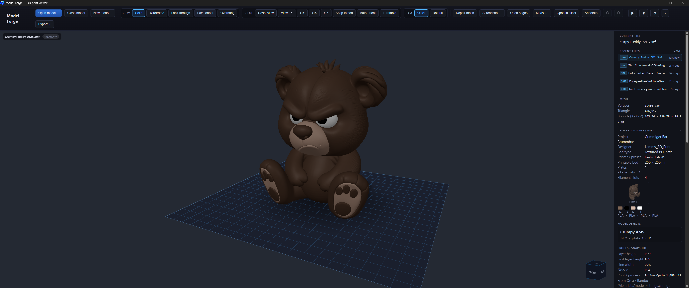
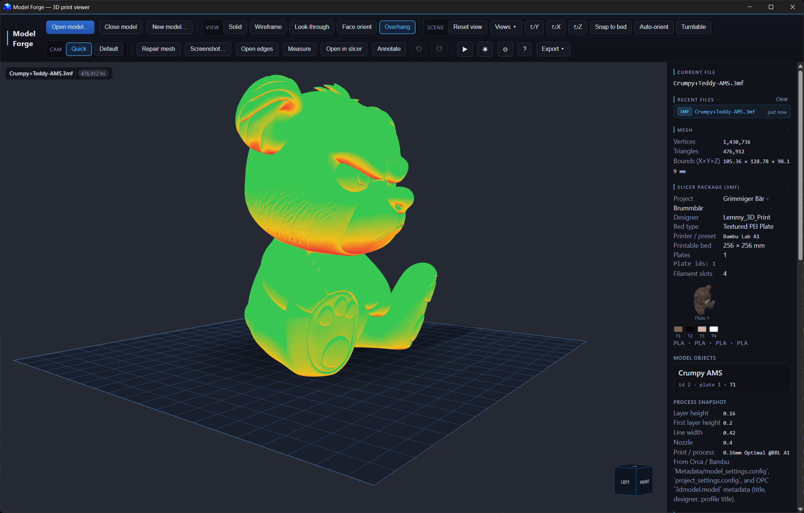
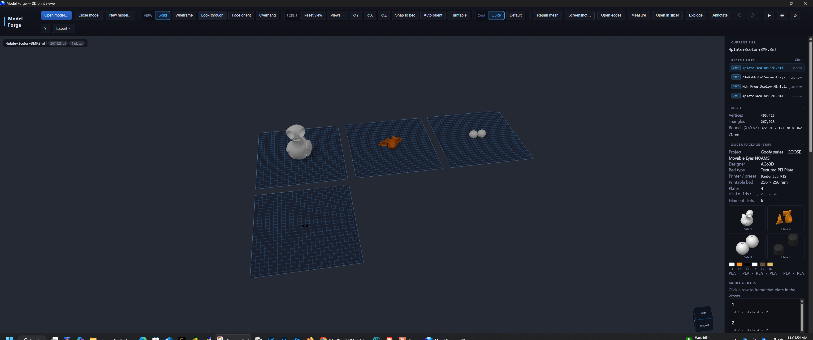

<div align="center">

# Model Forge

**A desktop 3D print viewer built for serious makers.**

Inspect, orient, analyze, and export your models before sending them to the slicer —
with full support for multi-plate and AMS color 3MF files.

[](https://github.com/SilentWolf75/Model-Forge/releases/latest)
[](#downloads)
[](LICENSE)




</div>

---

## Downloads

Grab the latest build from the [Releases](https://github.com/SilentWolf75/Model-Forge/releases) page.

| File | Platform | Description |
|------|----------|-------------|
| `Model Forge-x.x.x-Setup.exe` | Windows | Installer — Start Menu shortcut + file associations |
| `Model Forge-x.x.x-portable.exe` | Windows | Portable — single `.exe`, no install needed |
| `Model Forge-x.x.x-mac.dmg` | macOS | Universal DMG — Intel + Apple Silicon |

> **Windows:** 10 / 11 x64 &nbsp;·&nbsp; **macOS:** 10.15 Catalina or later (Intel + Apple Silicon)
>
> **Windows — SmartScreen warning:** The installer is not yet code-signed. Windows may show a blue "Windows protected your PC" dialog. Click **More info** → **Run anyway** to proceed. This is normal for indie software and will improve as the app gains more users.
>
> **macOS — first launch:** **Right-click → Open** to bypass the unsigned app warning.

---

## Features

### Print Preparation

- **Auto-orient** — non-3MF files (STL, OBJ, STEP, etc.) are automatically rotated flat-side-down on load, matching slicer placement
- **Snap to bed** — drops the model so its lowest vertex sits exactly on the plate
- **Rotate** — 90° steps around X, Y, and Z axes
- **Mesh repair** — removes degenerate triangles and welds open seams
- **Open edge detection** — highlights non-watertight boundary edges in orange

### Overhang Analysis

Faces are color-coded by their angle from horizontal using a real-time GLSL shader — green for printable, red for critical overhangs above 45°.



### Multi-Plate 3MF Support

Full support for the 3MF format, including multi-plate layouts, AMS color data, and slicer metadata.



- Multi-plate layout with correct per-plate positioning
- AMS multi-color filament display with color swatches
- NOAMS (single-extruder multi-plate) correct per-plate colors
- Filament slot labels (T1, T2…) and material names
- Slicer metadata: printer profile, bed type, layer height, nozzle size

### Viewing

- Solid, Wireframe, Look-through, Face-orient, and Overhang view modes
- Screen-space ambient occlusion for realistic depth
- Turntable auto-rotate for hands-free presentation
- Exploded view for multi-body models
- Light / dark theme with persisted preference
- Camera presets (Quick / Default)

### Analysis Sidebar

- Vertex and triangle count
- Bounding box dimensions (X × Y × Z mm)
- Surface area and volume
- Estimated print weight (PLA density)
- Shell count and overhang percentage
- Print readiness checklist with actionable tips
- Slicer package metadata (printer, bed, layer height, nozzle)

### Tools

| Tool | Description |
|------|-------------|
| **Measure** | Click two points on the model — get the straight-line distance in mm |
| **Annotations** | Pin text notes to any point on the model surface |
| **Command palette** `Ctrl+K` | Fuzzy search across all app actions |
| **Undo / Redo** `Ctrl+Z` / `Ctrl+Y` | 10-step history for all mesh operations |
| **Screenshot** | Export the current viewport as PNG |
| **Open in slicer** | Send the file directly to your default slicer app |
| **Batch export** | Export all plates of a multi-plate 3MF to individual STL files |

---

## Supported Formats

| Format | Notes |
|--------|-------|
| **3MF** | Full multi-plate metadata, AMS color, Orca Slicer compatible |
| **STL** | Binary and ASCII |
| **OBJ** | With MTL material file |
| **STEP / STP** | Via WASM CAD kernel (occt-import-js) |
| **PLY** | Binary and ASCII |
| **AMF** | Additive Manufacturing Format |
| **FBX** | Via Three.js loader |
| **GLTF / GLB** | Via Three.js loader |

---

## Keyboard Shortcuts

| Key | Action |
|-----|--------|
| `O` | Open file |
| `W` / `S` / `L` | Wireframe / Solid / Look-through |
| `H` | Overhang heat map |
| `T` | Toggle turntable |
| `R` | Reset camera |
| `P` | Screenshot |
| `Ctrl+Z` / `Ctrl+Y` | Undo / Redo |
| `Ctrl+K` | Command palette |
| `?` | Show all shortcuts |

---

## Building from Source

**Requirements:** Node.js 20+, npm

```bash
git clone https://github.com/SilentWolf75/Model-Forge.git
cd Model-Forge
npm install
npm run dev
```

**Build a distributable:**
```bash
npm run pack:win          # Windows: NSIS installer + portable .exe
npm run pack:win:setup    # Windows: NSIS installer only
npm run pack:mac          # macOS: universal DMG (Intel + Apple Silicon)
```

Output goes to the `release/` folder.

---

## Tech Stack

| Layer | Technology |
|-------|-----------|
| Desktop shell | Electron 35 |
| Frontend | React 18 + TypeScript 5 |
| 3D rendering | React Three Fiber (Three.js r184) |
| Post-processing | N8AO ambient occlusion |
| CAD kernel | occt-import-js (WASM) |
| 3MF / ZIP parsing | JSZip + fast-xml-parser |
| Build | electron-vite + Vite 8 |
| Packaging | electron-builder (NSIS + portable + DMG) |

---

## Demo Models

Models used in screenshots and demo are used with credit to their creators:

| Model | Designer | Source |
|-------|----------|--------|
| The Grumpy Bear — The Grumbler | [Lemmy3DPrint](https://makerworld.com/en/models/1665480-the-grumpy-bear-the-grumbler) | MakerWorld |
| Goofy Series — Turtle Movable Eyes NOAMS | [AGo3D](https://makerworld.com/en/models/2776672-goofy-series-turtle-movable-eyes-noams) | MakerWorld |

---

## License

MIT
